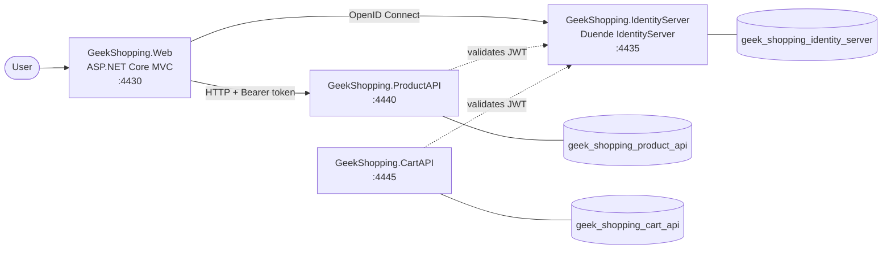

# 🛒 GeekShopping — Microservices E-commerce in .NET 6

An online store for geek products built with a **microservices architecture** on **.NET 6**. It has an ASP.NET Core MVC front end, independent REST APIs (each with its own database), and centralized authentication with **Duende IdentityServer** (OAuth 2.0 / OpenID Connect).

> 🚧 **Work in progress** — the product catalog, authentication and product management are working end to end. The Cart API is in place, but it is not yet consumed by the front end.

---

## 🧱 Architecture



| Project | Type | Port (HTTPS) | Responsibility |
|---|---|---|---|
| `GeekShopping.Web` | ASP.NET Core MVC | `4430` | Front end: catalog, product details, product management, login/logout |
| `GeekShopping.IdentityServer` | Duende IdentityServer 6 + ASP.NET Identity | `4435` | Authentication, user and role management, token issuing |
| `GeekShopping.ProductAPI` | REST API | `4440` | Product catalog (CRUD) |
| `GeekShopping.CartAPI` | REST API | `4445` | Shopping cart (header + details) |

Each service owns its **own SQL Server database** (database-per-service).

## ✨ Features

- **Product catalog** on the home page, with a details page for authenticated users.
- **Product management** (create, edit, delete) in the front end, consuming the Product API with the user's access token.
- **Authentication with OpenID Connect** (Authorization Code flow): login and logout are handled by IdentityServer, and the front end keeps a cookie session.
- **Role-based authorization** (`Admin` and `Client`): only admins can delete products.
- **JWT Bearer protection** on the APIs, with IdentityServer as the authority.
- **Cart API** with create, read, update and delete endpoints for the cart.
- **Swagger** with Bearer token support on the APIs.
- **AutoMapper** for mapping between entities and Value Objects (VOs).
- **Serilog** request logging on IdentityServer.

## 🛠️ Tech Stack

| Area | Technology |
|---|---|
| Runtime | .NET 6 / ASP.NET Core (MVC, Web API, Razor Pages) |
| Identity | Duende IdentityServer 6, ASP.NET Core Identity, OpenID Connect, JWT Bearer |
| Data | Entity Framework Core 6 (Code First + Migrations), SQL Server |
| Mapping | AutoMapper 11 |
| API docs | Swashbuckle (Swagger + Annotations) |
| Logging | Serilog |
| Front end | Razor Views, Bootstrap |

## 🔌 API Endpoints

### Product API — `https://localhost:4440/api/v1/product`

| Method | Route | Auth | Description |
|---|---|---|---|
| `GET` | `/` | Public | Lists all products |
| `GET` | `/{id}` | Authenticated | Gets a product by id |
| `POST` | `/` | Authenticated | Creates a product |
| `PUT` | `/` | Authenticated | Updates a product |
| `DELETE` | `/{id}` | `Admin` role | Deletes a product |

**Product:** `id`, `name`, `price`, `description`, `categoryName`, `imageURL`

### Cart API — `https://localhost:4445/api/v1/cart`

| Method | Route | Description |
|---|---|---|
| `GET` | `/find-cart/{userId}` | Gets the user's cart |
| `POST` | `/add-cart` | Adds items to the cart |
| `PUT` | `/update-cart` | Updates the cart |
| `DELETE` | `/delete-cart/{id}` | Removes an item from the cart |

## 🚀 Getting Started

### Prerequisites

- [.NET 6 SDK](https://dotnet.microsoft.com/download/dotnet/6.0)
- SQL Server (Express or LocalDB)
- EF Core CLI: `dotnet tool install --global dotnet-ef`

### 1. Clone the repository

```bash
git clone https://github.com/Roger8973/Loja_Virtual_Net6.git
cd Loja_Virtual_Net6/GeekShopping
```

### 2. Configure the connection strings

Update the `appsettings.json` of each service to point to your SQL Server instance:

| Service | Key | Database |
|---|---|---|
| IdentityServer | `ConnectionStrings:ConnectionSqlServer` | `geek_shopping_identity_server` |
| ProductAPI | `ConnectionStrings:DefaultConnection` | `geek_shopping_product_api` |
| CartAPI | `ConnectionStrings:DefaultConnection` | `geek_shopping_cart_api` |

Example using LocalDB:

```json
"Server=(localdb)\\mssqllocaldb;Database=geek_shopping_product_api;Trusted_Connection=True;"
```

### 3. Apply the migrations

```bash
dotnet ef database update --project GeekShopping.IdentityServer
dotnet ef database update --project GeekShopping.ProductAPI
dotnet ef database update --project GeekShopping.CartAPI
```

The Product API migrations also seed the product table.

### 4. Run the services

Start IdentityServer first, then the APIs and the front end, each in its own terminal:

```bash
dotnet run --project GeekShopping.IdentityServer
dotnet run --project GeekShopping.ProductAPI
dotnet run --project GeekShopping.CartAPI
dotnet run --project GeekShopping.Web
```

Each project's default launch profile already uses the HTTPS ports listed above.

In Visual Studio, you can instead set up **Multiple Startup Projects** in the solution.

Open the front end at `https://localhost:4430`. Swagger is available at `/swagger` on each API.

### Seed users

On first startup, IdentityServer creates the `Admin` and `Client` roles and the following users:

| Username | Password | Role |
|---|---|---|
| `roger-admin` | `Roger123$` | Admin |
| `roger-client` | `Roger123$` | Client |

> ⚠️ These credentials, the client secrets in `IdentityConfiguration.cs` and the signing keys in `keys/` are for local development only.

## 📁 Repository Structure

```
GeekShopping/
├── GeekShopping.Web/            # MVC front end (Controllers, Views, Services → HttpClient)
├── GeekShopping.IdentityServer/ # Duende IdentityServer (Configuration, Initializer, Pages, Services)
├── GeekShopping.ProductAPI/     # Product API (Controllers, Repository, Model, Data/ValueObjects, Migrations)
├── GeekShopping.CartAPI/        # Cart API (Controllers, Repository, Model, Data/ValueObjects, Migrations)
└── GeekShopping.sln
```

## 📌 Roadmap

- [ ] Consume the Cart API in the front end
- [ ] Protect the Cart API endpoints with `[Authorize]`
- [ ] Coupon API
- [ ] Order API and checkout
- [ ] Asynchronous messaging between services (RabbitMQ)
- [ ] Payment API
- [ ] API Gateway (Ocelot)
- [ ] Docker / docker-compose for the whole stack
- [ ] Move secrets to user secrets / environment variables
- [ ] Automated tests
- [ ] Upgrade to .NET 8 (LTS) — .NET 6 is out of support

## 📄 License

Distributed under the [Apache 2.0 License](LICENSE).

## 👤 Author

**Roger Fraga Messina** — [GitHub](https://github.com/Roger8973)
